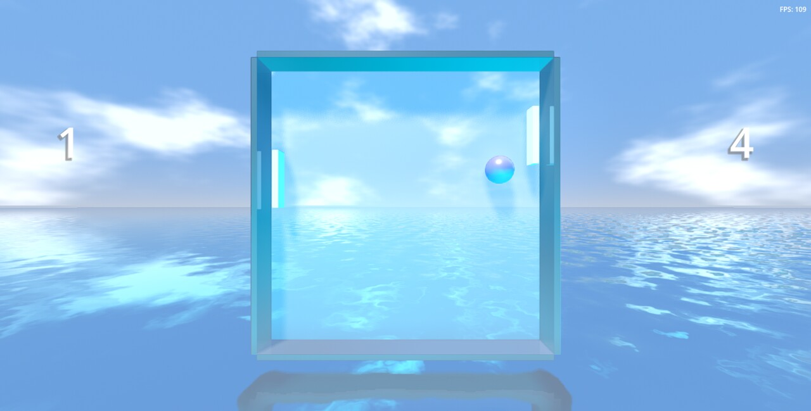

# Overly Bright Pong Clone

A relatively unimpressive Pong clone with blindingly bright visuals. Meant to be a small project for learning the basics of [Godot](https://godotengine.org).

Made with [Godot](https://godotengine.org) 4.1.2.

## Running

The project can probably be started with this version or later. Once it's been opened, it can just be run normally the same as any other [Godot](https://godotengine.org) project (the default is the F5 key).

## Playing

Game starts as soon as it's opened. There is no sound, so expect silence. Game also continues indefinitely, there is no target score for either side.

To move the platform up and down, standard controls can be used, such as moving the mouse up and down, swiping up and down on a touch screen, using they keyboard's arrow keys or W and S. If you're playing with a gamepad, the D-pad up and down buttons can be used and the left analog can be moved up and down as well.

To restart, press Enter or F on the keyboard. If you're playing with a gamepad, the A button (bottom face button) can be used.

To quit, press Backspace or Escape on the keyboard. If you're playing with a gamepad, the B button (bottom face button) can be used.
